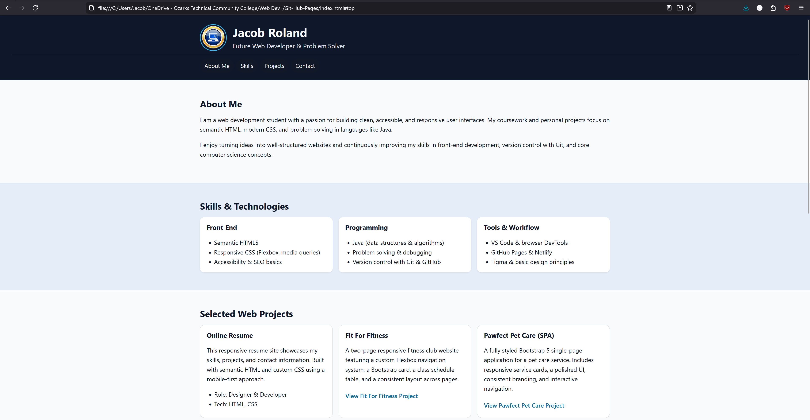

# Online Resume – Jacob Roland

A fully responsive, mobile-first online resume website built using semantic HTML and custom CSS.  
This project showcases my skills, coursework, and web development projects completed during Web Dev I.  
It is published through GitHub Pages and organized according to professional file-structure standards.

---

## 👨‍💻 Developer
**Jacob Roland**

---

## 🌐 Live Site  
**GitHub Pages URL:**  
https://jwroland.github.io/ 

---

## 📄 Project Overview
This project serves as my final exam submission for Web Dev I.  
It includes:

- A responsive, mobile-first layout  
- Semantic HTML structure (header, nav, main, section, footer)  
- Accessible navigation and labeled form fields  
- Logical heading hierarchy and optimized images  
- CSS organized into a dedicated `/css/styles.css` file  
- Past web development projects included under `/webprojects/`  
- Fully validated HTML and CSS (W3C)  

The website is intended to act as a professional online resume that I can continue improving after the course.

---

## 🧱 File Structure
root/
│
├─ index.html
├─ README.md
│
├─ css/
│ └─ styles.css
│
├─ images/
│ ├─ profile.png
│ └─ readme.png
│
└─ webprojects/
├─ fitforfitness/
├─ pawfectpetcare/
└─ baitshop/

---

## 🛠️ Technologies Used
- **HTML5**
- **CSS3**
- **Flexbox layout**
- **Mobile-first responsive design**
- **Git & GitHub Pages**

---

## 📸 Screenshot

---

## 🔗 Included Web Projects
The following completed assignments are included inside the `/webprojects/` directory:

- **Fit For Fitness** (Responsive 2-page fitness site)
- **Pawfect Pet Care** (Bootstrap 5 single-page application)
- **Live Bait Shop** (Multi-section marketing site)

Each project includes a full, working copy of its original structure and files.

---

## 📬 Contact
**Email:** jacobwroland@gmail.com  
**GitHub:** https://github.com/jwroland  
**Location:** Springfield, Missouri  

---

## ✔ Validation
All code has been tested with:

- **W3C HTML Validator**
- **W3C CSS Validator**

Errors have been corrected to avoid the 20% deduction noted in the rubric.

---

## ✔ Requirements Checklist
This project satisfies all rubric items:

### **Structure & Content**
- [x] Header with name + tagline  
- [x] Navigation with anchor links  
- [x] About, Skills, Projects sections  
- [x] Contact info + labeled form fields  

### **Accessibility & Semantic HTML**
- [x] Semantic elements used correctly  
- [x] Logical heading order  
- [x] Alt attributes on images  
- [x] Readable text contrast  
- [x] Descriptive navigation link text  
- [x] Proper labels on form fields  

### **Styling**
- [x] External stylesheet located in `/css/styles.css`  
- [x] Clean, intentional visual design  
- [x] No unused or leftover code  

### **Mobile Design**
- [x] Mobile-first approach  
- [x] Media queries organized from small → large  
- [x] Meaningful layout changes at each breakpoint  
- [x] Fully readable on phone, tablet, and desktop  

### **File Structure**
- [x] Organized folders (`css`, `images`, `webprojects`)  
- [x] index.html in root  
- [x] Working relative paths  

### **GitHub & Publishing**
- [x] Published with GitHub Pages  
- [x] README includes name, description, screenshot, live URL  
- [x] 3+ meaningful commits  

---

## 📚 Course
**Web Development I – Final Resume Project (Fall 2025)**  
Ozarks Technical Community College

---