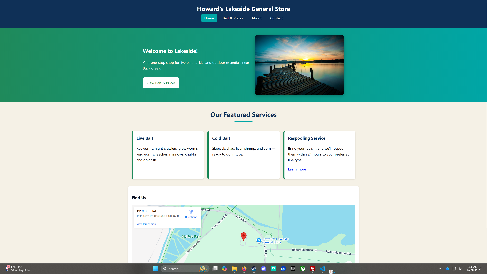

# Live Bait Shop Redesign

**Name:** Jacob Roland  
**Class:** Web Development I (CIS130)  
**Project:** Live Bait Website

---

### 🎣 Project Description
A redesigned, mobile-friendly, and accessible version of **Howard’s Lakeside General Store** website.  
The project includes four pages — **Home**, **Bait & Prices**, **About**, and **Contact** — all built with semantic HTML5 and responsive CSS using Flexbox and Grid.  
Features include an embedded YouTube fishing tutorial, a Google Map, and a contact form with labeled inputs for accessibility.

---

### 🌐 Live URL
[https://ozarktechwebdev.com/jacob/baitshop/](https://ozarktechwebdev.com/jacob/baitshop/)

---

### 🖼️ Screenshot

---

### 🧰 Technologies Used
- HTML5  
- CSS3 (Flexbox + Grid + Media Queries)  
- WCAG 2.1 AA Accessibility  
- Responsive, mobile-first design  

---

### ✅ Final Checklist
- [x] File named **README.md**  
- [x] Includes name, class, project, and live link  
- [x] Screenshot (`screenshot.png`) in same folder  
- [x] Verified link works in browser  
- [x] All files committed and pushed to GitHub  

---

© 2025 Jacob Roland | Howard’s Lakeside General Store Redesign
