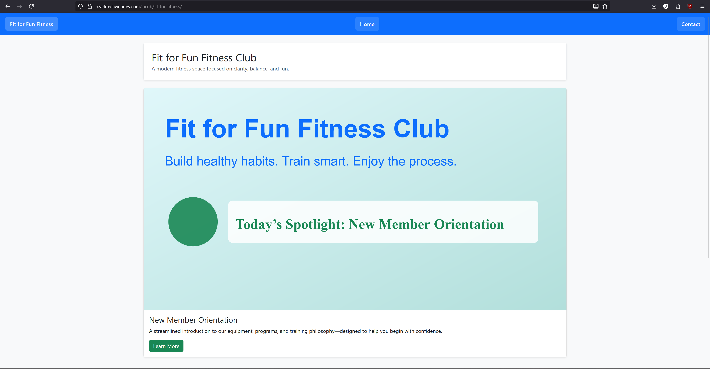

# Fit for Fitness
**Author:** Jacob Roland
# **Collaborator** Matthew Kolbe #
A two-page responsive website designed for the Fit for Fun Fitness Club.  
This project combines a custom Flexbox-based navigation system with Bootstrap 5’s professional UI components.

## Project Overview
This site includes:
- A **custom Flexbox navigation bar** (mobile-first, switches to horizontal via media query)
- A **Bootstrap-styled container** for clean, centered layouts
- A **single Bootstrap card** featuring a premium SVG hero image, heading, paragraph, and green action button
- A **Bootstrap table** listing upcoming fitness classes (5×5 minimum)
- A **contact page** with matching navigation and consistent layout

## Pages Included
- `index.html` — Main homepage with card + class schedule  
- `contactus.html` — Placeholder contact page with matching navigation  
- `styles.css` — Custom Flexbox navigation and styling  
- `images/` — Contains the SVG used for the card

## Live URL
https://www.ozarktechwebdev.com/jacob/fit-for-fitness/

## Screenshot
